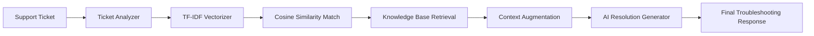

# SupportPilot — Milestone 2: AI Knowledge Retrieval (RAG Pipeline)

Milestone 2 extends the SupportPilot foundation with an automated **Retrieval-Augmented Generation (RAG)** pipeline. It analyzes incoming support tickets, searches a curated IT knowledge base using TF-IDF vectorization and Cosine Similarity, augments query context, and generates verified troubleshooting steps.

---

## 🔄 Milestone 2 RAG Workflow



1. **Ticket Intake & Normalization**: User submits an issue via the AI Resolution interface.
2. **Ticket Analyzer (`rag/analyzer.py`)**: Extracts key error keywords, diagnostic terms, and categorized symptoms.
3. **TF-IDF & Cosine Similarity (`rag/retriever.py`)**: Computes semantic vectors against the knowledge-base corpus (`data/knowledge_base.json`) and scores document relevance using cosine similarity.
4. **Knowledge Retrieval**: Top-ranked knowledge articles meeting the relevance threshold (e.g., $\ge 0.35$) are retrieved.
5. **Context Augmentation (`rag/generator.py`)**: Knowledge snippets, diagnostic context, and ticket symptoms are combined.
6. **AI Resolution Generation (`rag/pipeline.py`)**: Generates structured, step-by-step resolution plans with verification checks.

---

## 📁 Main Files & Structure

```text
Milestone-2/
├── app.py                     # Flask application with RAG and classification routes
├── classifier.py              # ML ticket classification
├── database.py                # Database persistence
├── priority.py                # Priority assignment rules
├── severity.py                # Severity calculation rules
├── status.py                  # Status management
├── test_rag.py                # RAG pipeline test and validation script
├── train_model.py             # ML model training
├── requirements.txt           # Python dependencies
├── .env.example               # Environment variable template
├── data/
│   └── knowledge_base.json    # IT support solutions and troubleshooting corpus
├── rag/                       # RAG Pipeline modules
│   ├── analyzer.py            # Query symptom extraction and analysis
│   ├── generator.py           # Context-augmented resolution generation
│   ├── pipeline.py            # End-to-end RAG orchestrator
│   └── retriever.py           # TF-IDF & Cosine similarity document retriever
├── templates/
│   ├── ai_resolution.html     # Dedicated AI Resolution interactive UI
│   ├── dashboard.html         # Operational analytics dashboard
│   ├── index.html             # Ticket intake form
│   ├── login.html             # Authentication login
│   ├── register.html          # Authentication registration
│   └── severity_guide.html    # Severity guide
└── static/                    # CSS, images, and static assets
```

---

## 🛠️ Technologies Used

- **NLP & Information Retrieval**: Scikit-learn (TfidfVectorizer), NumPy, Cosine Similarity
- **Backend Framework**: Python 3.10+, Flask, Jinja2
- **Database**: SQLite3
- **Frontend**: HTML5, CSS3, JavaScript, Bootstrap 5, FontAwesome

---

## 📦 Installation & Setup

1. **Navigate to Milestone-2**:
   ```bash
   cd Milestone-2
   ```

2. **Install dependencies**:
   ```bash
   pip install -r requirements.txt
   ```

3. **Configure environment**:
   ```bash
   cp .env.example .env
   ```

4. **Verify RAG pipeline**:
   ```bash
   python test_rag.py
   ```

5. **Start application**:
   ```bash
   python app.py
   ```
   Navigate to `http://127.0.0.1:5001/ai-resolution` to test knowledge retrieval.
