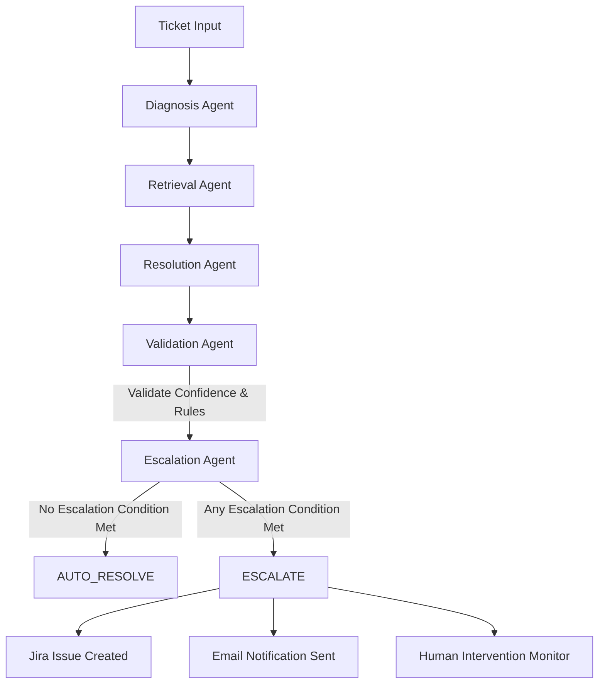

# SupportPilot — Milestone 4: Multi-Agent AI Resolution, Escalation & Analytics

Milestone 4 represents the production-ready Multi-Agent AI Ticket Resolution and Escalation System. It orchestrates five specialized AI agents, executes deterministic escalation policies, synchronizes tickets with Jira and SMTP email notifications, monitors human intervention, and visualizes system performance across seven key KPI metrics.

---

## 🤖 Multi-Agent Architecture

The multi-agent system (`agents.py`) coordinates five specialized agents:



1. **Diagnosis Agent**: Analyzes error symptoms, technical domain, urgency, and core problem.
2. **Retrieval Agent**: Executes RAG search against knowledge articles, returning similarity scores and matched documents.
3. **Resolution Agent**: Synthesizes verified troubleshooting steps and resolution completeness.
4. **Validation Agent**: Computes overall AI confidence score based on diagnostic clarity, retrieval relevance, and resolution completeness.
5. **Escalation Agent**: Evaluates strict business escalation rules and executes external actions (Jira/Email).

---

## ⚠️ Five Strict Escalation Conditions

The Escalation Agent evaluates five deterministic conditions in order:

| Condition # | Rule Name | Trigger Criteria | Action Taken |
| :--- | :--- | :--- | :--- |
| **1** | **Critical Priority** | Ticket priority is `CRITICAL` or severity is `CRITICAL` | Immediate human escalation |
| **2** | **Low AI Confidence** | Final computed AI confidence score is below **70.0%** (`< 0.70`) | Escalated for human review |
| **3** | **Resolution Failure** | Knowledge base query failed or resolution completeness is inadequate | Escalated to engineering |
| **4** | **Customer Request** | Customer explicitly requested human intervention | Routed to human support agent |
| **5** | **Repeated Attempts** | Ticket has $\ge 3$ repeated unresolved attempts | Escalated to senior support |

> **Auto-Resolve Policy**: If **none** of the above 5 escalation conditions are met, the workflow automatically finishes with **`AUTO_RESOLVE`**.

---

## 📊 Milestone 4 Performance Analytics & Visualizations

The Dashboard provides real-time, live operational intelligence:

1. **Seven Key Performance Indicator (KPI) Cards**:
   - **AI Resolution Rate**: % of total tickets automatically resolved without human intervention.
   - **Resolution Success**: % of resolved tickets with positive outcomes.
   - **Classification Accuracy**: % of verified classifications matching true categories.
   - **Knowledge-Base Coverage**: % of tickets with relevant matching KB documentation.
   - **Customer Satisfaction (CSAT)**: Average user rating on a 1.00–5.00 scale.
   - **Average Resolution Time**: End-to-end resolution latency in seconds.
   - **Average AI Response Time**: Multi-agent workflow latency in seconds.

2. **Visualizations**:
   - **AI Performance Overview**: Unified bar chart displaying all seven metrics with actual units (`%`, `5.00 / 5`, `seconds`).
   - **AI Resolution vs Escalation**: Live doughnut chart displaying `AUTO_RESOLVE` vs `ESCALATE` distribution.
   - **Classifier Evaluation**: Confusion matrix metrics (Accuracy, Precision, Recall, F1 score).
   - **Human Intervention Monitor**: Real-time table tracking all escalated tickets, reasons, repeated attempts, and direct Jira links.

---

## 📁 Main Files & Structure

```text
Milestone-4/
├── app.py                     # Flask application, /health, /api/analytics, and auth routes
├── agents.py                  # MultiAgentSupportPilot and 5 specialized agents
├── classifier.py              # ML classification model inference
├── database.py                # SQLite persistence and analytics calculation queries
├── email_service.py           # SMTP email notification handler
├── jira_service.py            # Atlassian Jira REST API v3 escalation integration
├── priority.py                # Priority assignment rules
├── severity.py                # Severity definitions and calculations
├── status.py                  # Ticket status utilities
├── test_rag.py                # RAG validation script
├── train_model.py             # ML model training
├── requirements.txt           # Python dependencies
├── .env.example               # Environment variables template
├── data/
│   └── knowledge_base.json    # Domain knowledge base
├── rag/                       # RAG Pipeline
│   ├── analyzer.py
│   ├── generator.py
│   ├── pipeline.py
│   └── retriever.py
├── templates/                 # Jinja2 HTML templates
│   ├── agents.html            # Multi-agent execution interface
│   ├── ai_resolution.html     # AI resolution page
│   ├── dashboard.html         # Performance analytics, charts & Human Intervention Monitor
│   ├── index.html             # Ticket intake form
│   ├── login.html             # Login page
│   ├── register.html          # Registration page
│   └── severity_guide.html    # Severity guidelines
└── static/                    # CSS, images, and assets
```

---

## 🛠️ Technologies Used

- **Multi-Agent AI & NLP**: Python 3.10+, Scikit-learn, TF-IDF, Cosine Similarity
- **Integrations**: Atlassian Jira Cloud REST API, SMTP SSL/TLS Email
- **Backend & API**: Flask, Flask-JWT-Extended, RotatingFileHandler logging, `/health` endpoint
- **Database**: SQLite3
- **Frontend & Visualization**: HTML5, CSS3, JavaScript (ES6+), Chart.js, Bootstrap 5, FontAwesome

---

## 📦 Installation & Setup

1. **Navigate to Milestone-4**:
   ```bash
   cd Milestone-4
   ```

2. **Install dependencies**:
   ```bash
   pip install -r requirements.txt
   ```

3. **Configure environment variables**:
   ```bash
   cp .env.example .env
   # Edit .env with your JWT secret, SMTP credentials, and Jira API token
   ```

4. **Start the application**:
   ```bash
   python app.py
   ```
   Open `http://127.0.0.1:5001` in your browser.
